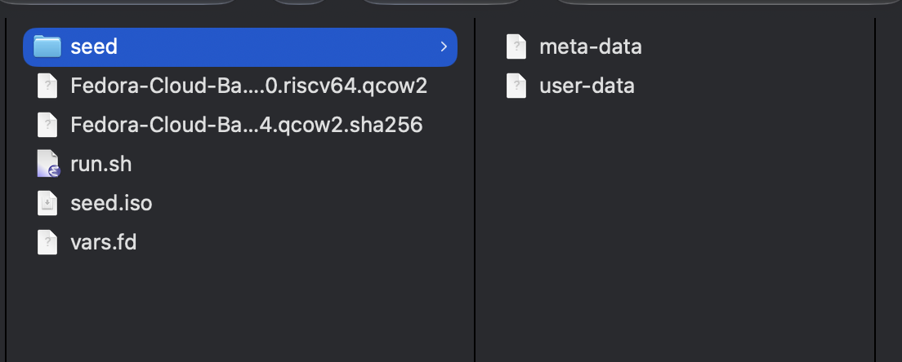

# Running Fedora on architectures you don't own

I needed (i 100% need them btw frfr) ppc64le and riscv64 machines for build testing. Buying either in Türkiye is
basically not happening .d, so I made three Fedora 44 VMs instead: x86_64, ppc64le,
and riscv64.

My Mac is arm64, which means all three run through software emulation. It is not fast,
but it works, and I no longer need to hunt for a mysterious PowerPC server on sahibinden (does not exist btw).

## Cloud images save a lot of pain

Use Fedora Cloud Base images. They are already installed, so you can skip sitting in
an installer three times. The only catch is that there is no user or password yet.

That is what cloud-init is for. Make a `user-data` file like this:

```yaml
#cloud-config
users:
  - name: your_name
    sudo: ALL=(ALL) NOPASSWD:ALL
    shell: /bin/bash
    lock_passwd: false
    ssh_authorized_keys:
      - ssh-ed25519 AAAA... me@example.com
chpasswd:
  expire: false
  users:
    - { name: your_name, password: fedora, type: text }
ssh_pwauth: true
```

There are a few tiny gotchas because of course there are:

1. The first line must be exactly `#cloud-config`. It looks like a comment, but it is
   doing actual work.
2. The seed image volume label must be `CIDATA`.
3. Keep `expire: false` unless you want Fedora to demand a password change on the
   first login.

I keep both an SSH key and a console password. The password is useful when networking
decides it needs five more minutes to discover DHCP.

You also need a `meta-data` file:

```yaml
instance-id: fedora-test-01
local-hostname: fedora-test
```

Change the `instance-id` when you want cloud-init to run again. If you edit
`user-data` but keep the same ID, cloud-init sees it and says "already did that".

## Making the seed ISO on macOS

macOS does not have `cloud-localds`, very cool. `hdiutil` still gets the job done:

```
hdiutil makehybrid -o seed.iso seed -iso -joliet -default-volume-name CIDATA
```

The `seed` directory should contain `user-data` and `meta-data`. Check the result with:

```
file seed.iso
```

It should report an ISO 9660 filesystem with the `CIDATA` label.

If you changed the config and nothing happened, bump the instance ID and rebuild the
ISO. You can also run this inside the guest:

```
sudo cloud-init clean --logs --reboot
```

## Resize the disk before booting

The stock cloud images are around 5 GB, which disappears very quickly after a few
packages. Resize them before the first boot:

```
qemu-img resize image.qcow2 40G
```

cloud-init grows the partition during boot. qcow2 is sparse, so it does not instantly
eat 40 GB from the host disk.

## UEFI needs its own writable variables file

x86_64 and riscv64 boot through edk2. They need a read-only firmware code file and a
writable variable store. The shipped variable store lives in a system directory, so
copy the matching one into each VM directory first.

For x86_64:

```
FW=$(dirname "$(readlink -f "$(command -v qemu-system-x86_64)")")/../share/qemu
cp "$FW/edk2-i386-vars.fd" vars.fd
chmod u+w vars.fd
```

For riscv64:

```
FW=$(dirname "$(readlink -f "$(command -v qemu-system-riscv64)")")/../share/qemu
cp "$FW/edk2-riscv-vars.fd" vars.fd
chmod u+w vars.fd
```

Yes, the x86_64 guest uses `edk2-i386-vars.fd`. There is no separately named x86_64
vars file. ppc64le avoids this whole side quest because `pseries` boots with SLOF.

## RISC-V wants everything spelled out

The riscv64 `virt` board is a little picky. `-drive ...,if=virtio` does not work here.
Define the file with `if=none`, give it an ID, then connect it using
`virtio-blk-device`.

The network device is `virtio-net-device`, not `virtio-net-pci`. The two pflash files
also need `unit=0` and `unit=1`. Miss one of those and edk2 may just sit there looking
dead, which is extremely helpful.

## Making TCG slightly less cooked

Use this for the emulated guests:

```
-accel tcg,thread=multi,tb-size=1024
```

It enables multithreaded translation and gives QEMU a 1 GB translation block cache.
Booting still takes a few minutes, but the machines are usable afterwards.

Forward a different host port to port 22 on each guest. SSH is much nicer than living
inside the serial console while a riscv64 terminal redraws one thought at a time.

## How I run them

I keep one `run.sh` in each VM directory. These are the actual commands I use on
macOS, with serial output in the terminal.

### x86_64

```bash
#!/usr/bin/env bash
set -euo pipefail
cd "$(dirname "$0")"

IMG=Fedora-Cloud-Base-Generic-44-1.7.x86_64.qcow2
FW=$(dirname "$(readlink -f "$(command -v qemu-system-x86_64)")")/../share/qemu

exec qemu-system-x86_64 \
  -machine q35 -cpu max -smp 4 -m 8G \
  -accel tcg,thread=multi,tb-size=1024 \
  -drive if=pflash,format=raw,readonly=on,file="$FW/edk2-x86_64-code.fd" \
  -drive if=pflash,format=raw,file=vars.fd \
  -drive file="$IMG",if=virtio,format=qcow2 \
  -drive file=seed.iso,if=virtio,format=raw,media=cdrom \
  -netdev user,id=n0,hostfwd=tcp::2223-:22 \
  -device virtio-net-pci,netdev=n0 \
  -nographic
```

### ppc64le

```bash
#!/usr/bin/env bash
set -euo pipefail
cd "$(dirname "$0")"

IMG=Fedora-Cloud-Base-Generic-44-1.7.ppc64le.qcow2

exec qemu-system-ppc64 \
  -machine pseries -cpu power9 -smp 4 -m 8G \
  -accel tcg,thread=multi,tb-size=1024 \
  -drive file="$IMG",if=virtio,format=qcow2 \
  -drive file=seed.iso,if=virtio,format=raw,media=cdrom \
  -netdev user,id=n0,hostfwd=tcp::2222-:22 \
  -device virtio-net-pci,netdev=n0 \
  -nographic
```

### riscv64

```bash
#!/usr/bin/env bash
set -euo pipefail
cd "$(dirname "$0")"

IMG=Fedora-Cloud-Base-Generic-44-20260604.0.riscv64.qcow2
FW=$(dirname "$(readlink -f "$(command -v qemu-system-riscv64)")")/../share/qemu

exec qemu-system-riscv64 \
  -machine virt -cpu rv64 -smp 7 -m 8G \
  -accel tcg,thread=multi,tb-size=1024 \
  -drive if=pflash,format=raw,unit=0,readonly=on,file="$FW/edk2-riscv-code.fd" \
  -drive if=pflash,format=raw,unit=1,file=vars.fd \
  -device virtio-blk-device,drive=hd0 \
  -drive file="$IMG",id=hd0,if=none,format=qcow2 \
  -device virtio-blk-device,drive=cd0 \
  -drive file=seed.iso,id=cd0,if=none,format=raw \
  -netdev user,id=n0,hostfwd=tcp::2224-:22 \
  -device virtio-net-device,netdev=n0 \
  -nographic
```

Make scripts executable (if you use) and start it:

```
chmod +x run.sh
./run.sh
```

Once SSH is up, connect using the port for that VM:

```
ssh -p 2223 your_name@127.0.0.1  # x86_64
ssh -p 2222 your_name@127.0.0.1  # ppc64le
ssh -p 2224 your_name@127.0.0.1  # riscv64
```

Press `Ctrl+A`, then `x` to leave QEMU when using `-nographic`.

At the end file structure should look like this:



## The annoying part

Most mistakes here did not produce a useful error. The VM just booted wrong or
cloud-init quietly skipped everything. If something looks cursed, check these first:

1. Is the volume label `CIDATA`?
2. Did you change the `instance-id`?
3. Does each pflash file have the correct unit number?
4. Are you using the correct virtio device type for the machine?

Those four checks saved me from reading a lot of logs that had nothing useful to say.
